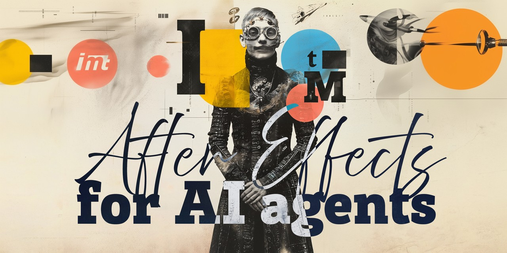

<p align="center"></p>

# AE-MCP-IMT — After Effects for AI agents, built to be safe to hand over

An MCP server that lets an AI agent (Claude Desktop, Cursor, ChatGPT or any
MCP-compatible client) drive a running Adobe After Effects: inspect projects, edit comps, layers,
effects, keyframes, text and masks, set expressions, render frames — from natural language.

Built by **[Immersive Media Technologies](https://github.com/Immersive-Media-Technologies)** as the
After Effects backbone of the Deep Artisan agent pipeline, and released so that other agent
builders can use the same, battle-tested layer.

**macOS and Windows · After Effects 2024–2026 · Node.js 24+.** After Effects itself runs only on macOS and
Windows, so Linux is not a target. macOS is what we run every day; the Windows transport (`AfterFX.exe -r`)
is inherited from upstream and works the same way — reports from Windows users are welcome.

> [!CAUTION]
> This tool edits real After Effects projects and sends project contents (comp and layer names,
> expressions, footage paths, rendered previews) to the AI service you use. Start with a copy of a
> project, check your AI provider's data policy for NDA work, and keep `AE_MCP_ENABLE_EVAL` off.

## Why this one

There are several After Effects MCP servers. Most stop at "the AI can call ExtendScript". This
one is designed around what an **autonomous agent** actually needs: a small, stable tool surface,
a real dry run, undo-safe operations, honest errors and an installer that says what is wrong.

|                              | **AE-MCP-IMT (this repo)**                                                                                                                                                                                                                                                                                                               | kumoproductions/mcp-aftereffects                                                                  | Dakkshin/after-effects-mcp                                            | directorhomaidm-ops/aftereffects-mcp                 |
| ---------------------------- | ---------------------------------------------------------------------------------------------------------------------------------------------------------------------------------------------------------------------------------------------------------------------------------------------------------------------------------------- | ------------------------------------------------------------------------------------------------- | --------------------------------------------------------------------- | ---------------------------------------------------- |
| Talks to AE via              | `osascript` per call — **nothing installed inside AE**                                                                                                                                                                                                                                                                                   | same (we are a fork)                                                                              | CEP panel polling every few seconds — must be installed and kept open | AppleScript `DoScript`, temp files                   |
| Operations                   | **199 atomic ops** behind 2 tools (`ae_catalog` / `ae_do`) — ~2 K tokens of tool schema per turn instead of 199 tools                                                                                                                                                                                                                    | 198 ops, same facade                                                                              | 14 commands                                                           | 80+ tools (every op = a tool in the model's context) |
| Dry run                      | **`ae_do {dryRun: true}` validates args and returns the generated ExtendScript without touching AE**                                                                                                                                                                                                                                     | `dryRun` existed only for JSON import; on `ae_do` it was silently dropped (the call ran for real) | —                                                                     | —                                                    |
| Undo                         | every `ae_do` call = one undo group (Cmd+Z reverts an agent step)                                                                                                                                                                                                                                                                        | same                                                                                              | —                                                                     | —                                                    |
| Effect presets               | 9 named templates (`glow`, `drop-shadow`, `cinematic-look`, `text-pop`, …) — **fixed**: two presets referenced effects that do not exist in AE (`ADBE Directional Blur`, `ADBE Glow`); properties addressed by index, so presets work on non-English AE (ru/ja) where by-name lookup returned `null` and silently applied factory values | —                                                                                                 | source of the presets (with those bugs)                               | —                                                    |
| Render output                | output folder created for `render.add_to_queue` / `render.set_om_settings` (AE fails with "Directory does not exist" otherwise)                                                                                                                                                                                                          | added later upstream                                                                              | —                                                                     | —                                                    |
| Install                      | `./install.sh`: checks macOS, AE, Node ≥ 24, builds, **runs a live self-test against AE** and prints the exact client config; failures are named (TCC −1743, scripting write access, Node path)                                                                                                                                          | manual                                                                                            | clone, build, install panel, keep panel open                          | `uv run`                                             |
| Permission policy for agents | reference deny-list in `docs/`: what to forbid is **what Cmd+Z cannot revert** (`eval.run`, `project.new/open`, purge/consolidate, `pref.*`, `render.start`) — everything else is safe to let the agent do                                                                                                                               | consent gate for app-config ops                                                                   | —                                                                     | —                                                    |
| Motion-graphics agent skill  | **AE Motion** (`skills/ae-motion`): reference image + brief → element breakdown → a natively built, **editable** comp (text/shape layers, real easing, expressions, a CONTROLS rig, Essential Graphics / MOGRT), checked by rendered frames; topic references from five open skill sets fetched on demand                                | —                                                                                                 | —                                                                     | —                                                    |
| Verified on                  | **AE 2026, macOS + Windows, Eng and Rus UI**                                                                                                                                                                                                                                                                                             | Windows + macOS                                                                                   | AE 2022+                                                              | AE 2026, macOS                                       |
| License                      | **IMT Non-Commercial** for our work (attribution + link required, free for non-commercial use); upstream code stays MIT                                                                                                                                                                                                                  | MIT                                                                                               | MIT                                                                   | not specified                                        |

Facts about other projects are from their READMEs on GitHub at the time of writing; corrections welcome.

## What you can ask for

- "Import this Illustrator file and animate the title with a text-pop preset."
- "Point out anything broken in this AEP — missing footage, expressions with errors, unused comps."
- "Apply the revisions from this PDF to the comps it names."
- "Add a glow to every text layer in _Intro_, 30 % lighter than now."
- "Render frame 120 of _Main_ so I can see the result."
- "Here is a reference frame: build this lower third natively — title, subtitle, accent bar — with a Speed slider and the texts in Essential Graphics." (with the AE Motion skill)

The agent combines the 199 operations (11 MCP tools) itself, checking project state between steps.

## Install

**macOS**

```bash
git clone https://github.com/Immersive-Media-Technologies/aftereffects-mcp-imt.git
cd aftereffects-mcp-imt
./install.sh
```

The installer verifies the environment, builds `dist/`, runs a live round-trip with After Effects
and prints the config block for your client.

**Windows**

```powershell
git clone https://github.com/Immersive-Media-Technologies/aftereffects-mcp-imt.git
cd aftereffects-mcp-imt
npm ci
npm run build
```

Then add the server to your client with the absolute path to `dist\index.js`; set `AE_MCP_EXE` to your
`AfterFX.exe` if After Effects is not in the default location. The installer script is macOS-only for now.

Requirements checked by the installer:

|               |                                                                                                                                                                                                               |
| ------------- | ------------------------------------------------------------------------------------------------------------------------------------------------------------------------------------------------------------- |
| macOS         | 13+ (tested on 26.5)                                                                                                                                                                                          |
| After Effects | 2024–2026 (tested on 26.3)                                                                                                                                                                                    |
| Node.js       | **≥ 24** at an absolute path — GUI apps on macOS do not see your shell `PATH`, so a Node from nvm is invisible to the client; use Homebrew or a fixed path, and never `"command": "npx"` in the client config |

Two permissions without which nothing works:

1. **Automation** — macOS must let the client control After Effects. The first call raises the
   system dialog; a refusal is remembered forever and shows up as AppleScript error **−1743**
   (System Settings → Privacy & Security → Automation).
2. **Scripting file access** — After Effects → Settings → Scripting & Expressions → _Allow Scripts
   to Write Files and Access Network_.

Client config (Claude Code shown; any MCP client works the same):

```json
{
  "mcpServers": {
    "aftereffects": {
      "command": "/opt/homebrew/bin/node",
      "args": ["/absolute/path/to/aftereffects-mcp-imt/dist/index.js"],
      "env": { "MCP_TIMEOUT": "120000" }
    }
  }
}
```

`MCP_TIMEOUT` of 120 s matters: a cold After Effects start plus the first `osascript` does not fit
the default 30 s. If your client caps tool output (Claude Code: `MAX_MCP_OUTPUT_TOKENS`), raise it
to 50 000 — `ae_project_info` on a real project is larger than the 25 000 default.

## Motion-graphics skill (AE Motion)

`skills/ae-motion/SKILL.md` teaches the agent to build motion graphics **as an editable After Effects
project**, not as a rendered clip: titles, lower thirds, kinetic type, logo stings, infographics,
transitions and overlays made of native text and shape layers, keyframes with real easing,
expressions driven by a `CONTROLS` null (Speed, Delay, colours, switches) and Essential Graphics
properties (MOGRT export on request). The workflow:

1. read the reference image and the motion brief; check that the fonts are installed;
2. show a breakdown table — what is built natively in AE, what is generated source material
   (illustrations as separate transparent PNGs), the background (still, video footage or
   generative — never baked into the plate), and what would need an external render (last resort);
3. build through `ae_do` / `batch.run` (one undo group per step), parent at rest, ease every key;
4. verify with a few `ae_render_frame` checks (entrance / mid / hold / exit) and report the controls.

The skill routes to topic references (easing and rigging, shapes, text animators, expressions,
MOGRT, ExtendScript pitfalls, After Effects 2026 changes, motion principles) from five open skill
sets. They are **fetched, not bundled**: run `skills/ae-motion/fetch-vendor.sh` once (pinned commits,
download only). The skill also maps those sets' tool names to this server's operations.

Use it as a skill in clients that support them (e.g. copy `skills/ae-motion` into
`~/.claude/skills/` for Claude Code / Claude Desktop), or point the model at `SKILL.md` in your
system prompt.

## Tools

| Tool                                                                     | Purpose                                                                                                                                |
| ------------------------------------------------------------------------ | -------------------------------------------------------------------------------------------------------------------------------------- |
| `ae_catalog`                                                             | list the 23 categories and 199 operations, or one operation with its parameters                                                        |
| `ae_do`                                                                  | run one operation (`operation`, `args`, `dryRun`) — one undo group per call; `batch.run` executes several operations in one undo group |
| `ae_context`                                                             | ambient context for the agent: project state, active comp, selection, ES3 rules, the undo contract                                     |
| `ae_project_info` / `ae_comp_info` / `ae_layer_info` / `ae_version_info` | introspection                                                                                                                          |
| `ae_save_project`                                                        | save                                                                                                                                   |
| `ae_project_export_json` / `ae_project_import_json`                      | whole-project round trip (also the way to snapshot and restore)                                                                        |
| `ae_render_frame`                                                        | render one frame to PNG for the agent to look at                                                                                       |

The full operation reference is generated from the source: [`docs/TOOLS.md`](docs/TOOLS.md).

## Safety model for agents

- **Dry run first.** `ae_do {dryRun: true}` returns the ExtendScript that _would_ run and never
  contacts After Effects. Let the agent plan, then execute.
- **Deny what Cmd+Z cannot revert.** Because every call is one undo group, creating, editing and
  even deleting layers is reversible and needs no gate. Forbid on the client side: `eval.run`
  (arbitrary ExtendScript = file system access), `project.new` / `project.open` (drop unsaved
  work), `project.reduce` / `purge` / `remove_unused_footage` / `consolidate_footage` (outside the
  undo stack), `pref.*` and `render.save_template` (change the application, not the project),
  `render.start` / `render.queue_in_ame` (write files, occupy AE). Nested batches must be gated by
  their inner `ops` — a batch wrapper is not a way around a rule.
- `AE_MCP_READONLY=1` for the first experiments on a new machine. `AE_MCP_ENABLE_EVAL` stays off.
- The upstream `npm test` **is not safe on macOS with After Effects open**: four transport tests
  assume a fake executable isolates them, but on macOS the path is not executed — the live AE
  answers. Run the suite with AE closed or on CI (where it self-skips).

## Changes against upstream

See [`CHANGELOG.md`](CHANGELOG.md) and [`THIRD-PARTY-NOTICES.md`](THIRD-PARTY-NOTICES.md). In short:
the `ae_do` dry run that really is one; effect templates that exist and work on localized AE, with
misses reported in `warnings`; render output folders; the installer with a live self-test; the agent
permission model and the macOS notes above. Upstream fixes are merged from
[kumoproductions/mcp-aftereffects](https://github.com/kumoproductions/mcp-aftereffects) by topic,
one at a time.

## License

**[IMT Non-Commercial License](LICENSE)** — © Immersive Media Technologies.

- **Non-commercial use only.** Selling this software, offering it as or inside a paid product or
  service, or using it in commercial client work requires a separate written license from
  Immersive Media Technologies.
- **Attribution is mandatory.** Every use, copy, fork or derived product must credit the creator,
  visibly to its users: `AE-MCP-IMT by Immersive Media Technologies — https://github.com/Immersive-Media-Technologies`.
- No warranty.

Full terms: [`LICENSE`](LICENSE). Third-party notices: [`THIRD-PARTY-NOTICES.md`](THIRD-PARTY-NOTICES.md).
